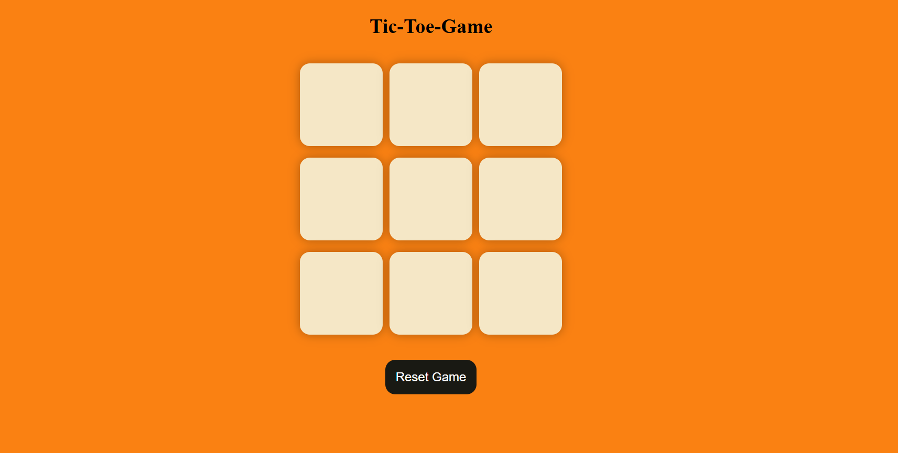
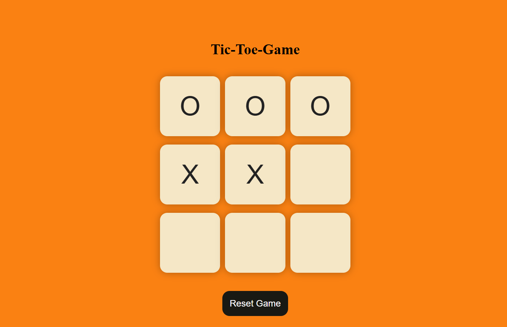
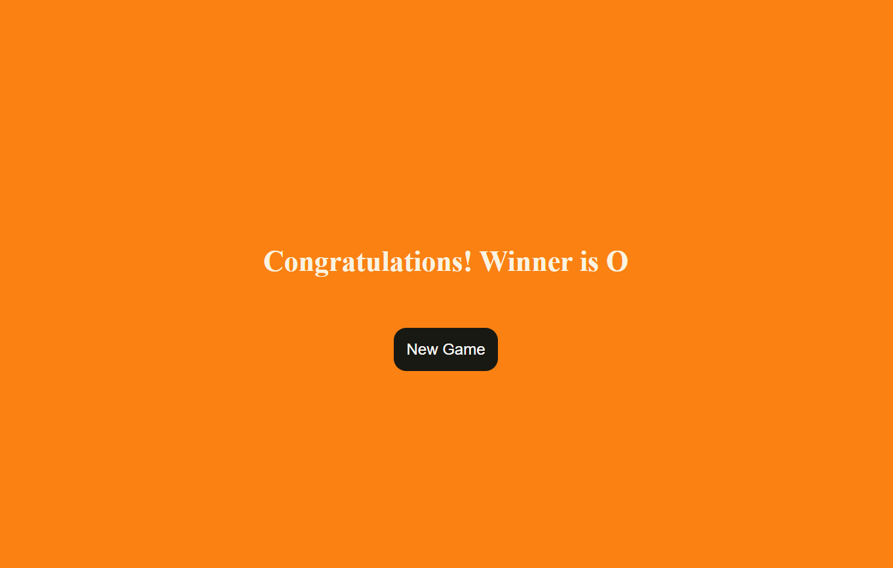
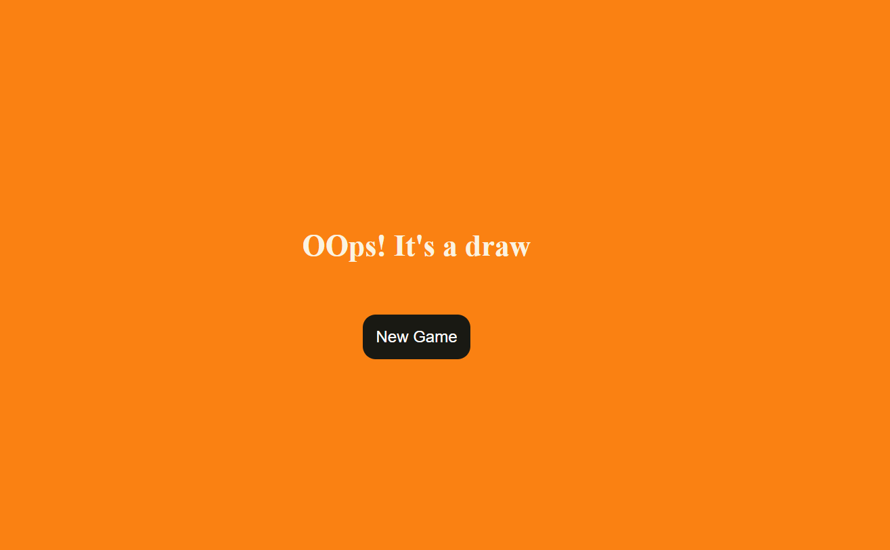

# 🎮 Tic Tac Toe Game (Responsive Web App)

A simple and interactive **Tic Tac Toe game** built using **HTML, CSS, and JavaScript**.  
The game is fully **responsive** and works smoothly on **desktop, tablet, and mobile devices**.

---

## 📌 Features

- Two-player game (Player X vs Player O)
- Displays winner after a successful match
- Detects and displays draw condition
- New Game and Reset Game functionality
- Fully responsive design
- Prevents overwriting already selected boxes

---

## 🛠️ Technologies Used

- HTML5
- CSS3
- JavaScript (ES6)

---

## 📷 Screenshots

### Game Start (Empty Board)

### Game in Progress

### Winner Screen

### Draw Screen

---

## 📁 Project Structure

Tic-Tac-Toe/
│
├── index.html
├── style.css
├── responsive.css
├── app.js
├── screenshots/
│ ├── start.png
│ ├── mid-game.png
│ ├── winner.png
│ └── draw.png
└── README.md

---

## 🚀 How to Run the Project

1. Download or clone the project
2. Open `index.html` in any modern web browser
3. Start playing the game

---

## 📱 Responsiveness

The game is designed to work on:
- Desktop
- Laptop
- Tablet
- Mobile phones

---

## 👨‍💻 Author

Developed by **Khushboo Rawat**
